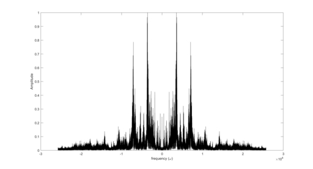
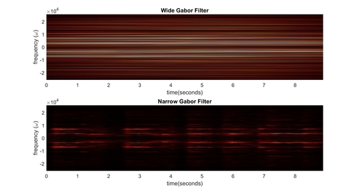

[](https://GitHub.com/Naereen/ama)


# Using Windowed Fourier Transforms to Study Low-Pass Audio Filters and Signal Processing

This project uses several types of windowed Fourier transforms to study music samples in a Time-Frequency domain. In particular, I study the tuning of such transforms, and the Heisenberg Uncertainty limitations on resolution in time and frequency. I also perform overtone filtering and study the efficacy of different window types for this task.
# Motivation

This project was originally begun to satisfy an assignment in a graduate level course in Data Science and Scientific Computing in the University of Washington's Applied Mathematics program.


# Framework

-MATLAB 2019

# Figure Examples

<br/>


# Code Example
```
%% Build the time and frequency domains

L = length(v)/Fs; n = length(v);
t2 = linspace(0, L, n+1); t = t2(1:n);
k = (2*pi/L)*[0:n/2-1 -n/2:-1]; ks = fftshift(k);
v = v(1:end - 1);
v_t = fft(v);

%% Plot in freq. domain of original file
close all
plot(ks,abs(fftshift(v_t))/max(abs(v_t)),'k'); %axis([-50 50 0 1])
%set(gca,'Fontsize',[14])
xlabel('frequency (\omega)'), ylabel('Amplitude')
```